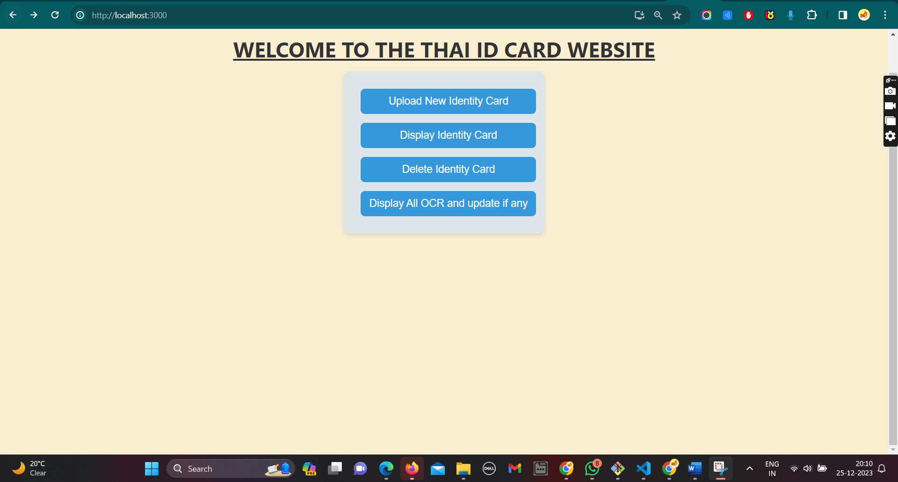
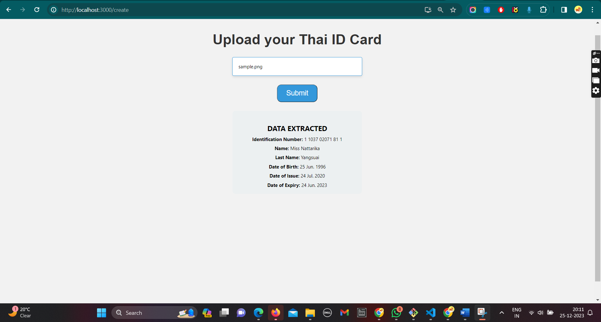
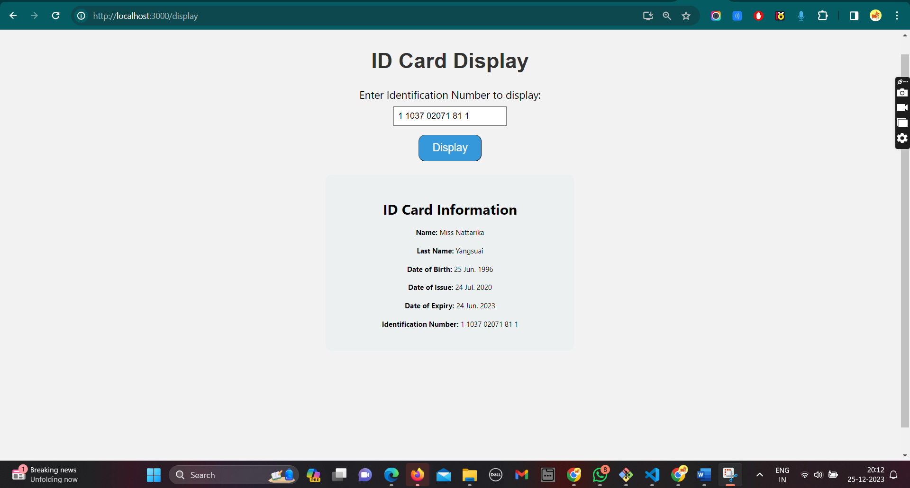
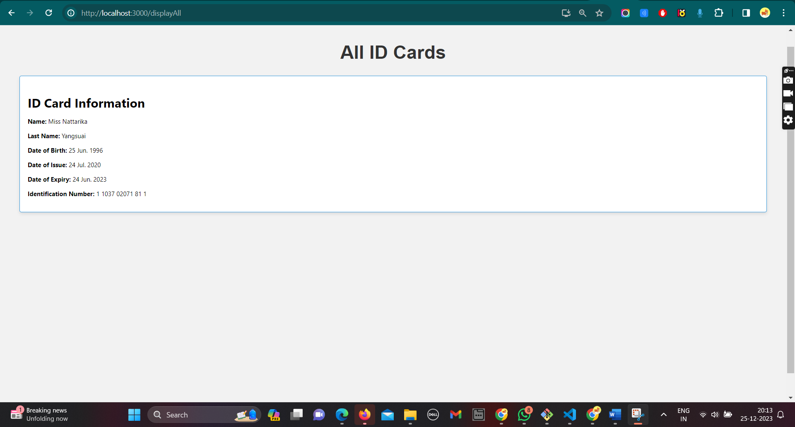

# Thai ID Card OCR Web Application

Welcome to the Thai ID Card OCR Web Application project! This web application allows users to upload Thai ID card images, extract relevant information using OCR (Optical Character Recognition), and perform various operations on the extracted data.

# Table of Contents

1. Features
2. Images
3. Getting Started
4. Installation
5. Folder Structure
6. Dependencies
7. Acknowledgements

# Features

Upload ID Card: Users can upload images of Thai ID cards.\
OCR Extraction: Utilizes OCR to extract information from the uploaded ID card images.\
Display and Delete: View and delete specific ID card information.\
Display All: Display a list of all uploaded ID cards.

# Images

# Getting Started

Step 1. Make a clone of this Repo using the link present above.\
Step 2. Open Project in VS Code and install all teh dependencies.

# Steps to Install dependency :

1> open two terminal -> Open the main project in one terminal and open server in 2nd Terminal\
2> Enter command as [npm install] in both terminal to install all dependency used in this project.\
3> Now make your own .env file in server for storing th mongoDB url as MONGO_URL and PORT = 8000.\
4> Add a folder in server as config and make a .js file named as serviceAccount.js and add service account credential in js format.\
5> Now to run the project : Enter command as [npm start] for first terminal and command as [node server.js] for second terminal i.e for server.

# Folder Structure

- node_module
- public
- Server
  - config
    - serviceAccounts.js
  - Controllers
    - ocrControllers.js
  - Models
    - OCRModel.js
  - node_modules
  - Routes
    - apiRoutes.js
  - .env
  - package-lock.json
  - package.json
  - server.js
    -src
  - pages
    - CreateNew.js
    - Delete.js
    - Display.js
    - DisplayAlll.js
    - HomePage.js
  - App.css
  - App.js
  - index.css
  - index.js
- package-lock.json
- package.json
- README.MD

# Dependency

- react
- react-router
- axios
- @google-cloud/vision
- dotenv
- express
- mongoose
- nodemon

# Acknowledgements

I would like to thank QOALA for giving me this assignment, I come to learn something new relate to OCR. I really enjoyed working upon this project and happy to say that i have completed this project in less than 3 days.
